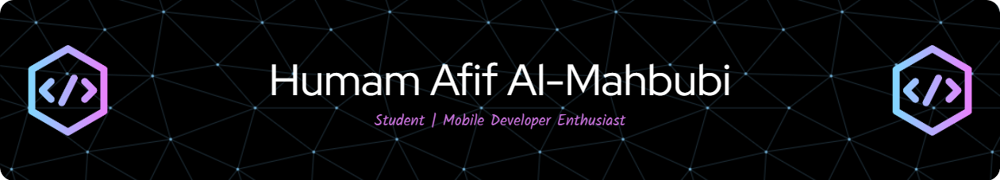

    

    
    
    
    

---

## About Me

I'm a passionate developer focused on creating elegant, user-centered digital experiences. With expertise in mobile development, I strive to build solutions that are both functional and intuitive.

- 🔭 Currently working on mobile applications with Flutter
- 🌱 Expanding my knowledge in backend development
- 👯 Open to collaborations and interesting projects
- 💬 Ask me about mobile development

 

## Tech Stack

<table>
    <tr>
        <td valign="top" width="33%">
            <h3 align="center">Frontend & Mobile</h3>
            

                
                
                
                
            

        </td>
        <td valign="top" width="33%">
            <h3 align="center">Backend</h3>
            

                
                
                
            

        </td>
        <td valign="top" width="33%">
            <h3 align="center">Database & Tools</h3>
            

                
                
                
            

        </td>
    </tr>
</table>

<!-- ---

## Projects & Contributions

  
  

 -->

---

## GitHub Analytics

  
  
  
<!--    -->

---

  

  
Thanks ✌️

